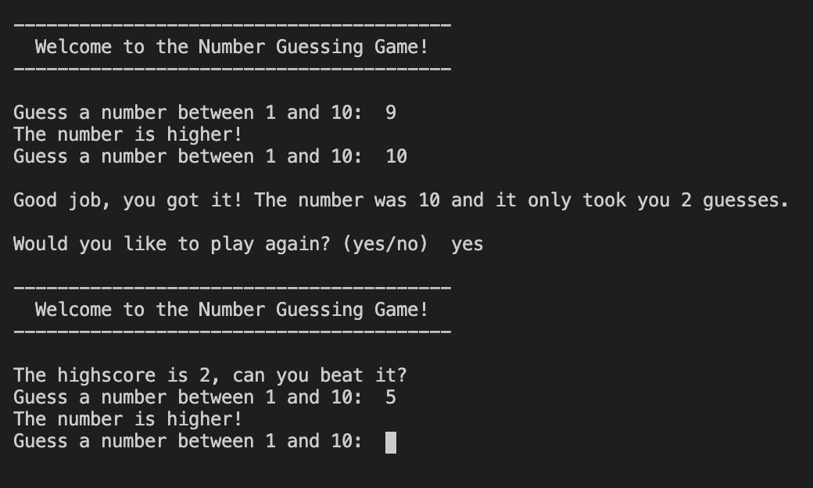

# Python-Number-Guessing-Game

This is a simple command line interface that generates a random number(currently between 1-10) and allows the user to try and guess that number. The user is allowed to play multiple subsequent games in a row without restarting the program and a new number will be generated each time as well as the highscore will be kept track of and displayed prior to each restart. 

